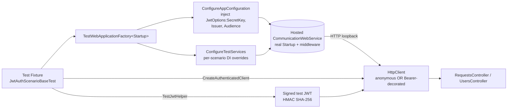

# ProjectV JWT Scenario Tests

Companion to
[`projectv-scenario-tests-overview.md`](./projectv-scenario-tests-overview.md)
and [`../Coverage/test-coverage.md`](../Coverage/test-coverage.md).
This document is the per-family scenario doc for the JWT-authentication
slice of `ProjectV.CommunicationWebService`. Scenarios live under
`Sources/Tests/ProjectV.CommunicationWebService.Tests/Scenarios/Jwt/` and
inherit the conventions described in the overview doc.

## Purpose

Cover the JWT runtime path of `ProjectV.CommunicationWebService` end-to-end
through `WebApplicationFactory<Startup>` — without mocking the authentication
pipeline. The scenarios exercise:

- The bearer-token validation path wired by
  `AddJtwAuthentication(jwtConfig)` in
  `Sources/WebServices/ProjectV.CommonWebApi/Service/Extensions/ServiceCollectionExtensions.cs`.
- The login round-trip exposed by
  `Sources/WebServices/ProjectV.CommunicationWebService/v1/Controllers/UsersController.cs`
  (`POST /api/v1/Users/login`).
- The protected entry point in
  `Sources/WebServices/ProjectV.CommunicationWebService/v1/Controllers/RequestsController.cs`
  (`POST /api/v1/Requests`).

The JWT path uses the in-memory user store
(`InMemoryUserInfoService`) — these tests do NOT require Testcontainers,
so they carry only `[Trait("Category", "Integration")]` (no
`[Trait("RequiresDocker", "true")]`) and run on both the Linux Integration
stage and the Windows Non-Docker stage of CI.

## Audience

- **Test authors** adding new JWT scenarios — for example expired-token,
  malformed-Authorization-header, or refresh-token-flow tests. They inherit
  from `JwtAuthScenarioBaseTest` and follow the conventions below.
- **Reviewers** scanning the family folder — the class XML doc on each
  test file reads like a business-language sentence so a reviewer can scan
  the directory and immediately see what behaviour is covered.

## Architecture

Each test class inherits the family base
[`JwtAuthScenarioBaseTest`](../../../Sources/Tests/ProjectV.CommunicationWebService.Tests/Scenarios/Jwt/JwtAuthScenarioBaseTest.cs),
which extends `ProjectV.Tests.Shared.ForTests.WebApiBaseTest<Startup>`. The
base test wires up an in-process
`TestWebApplicationFactory<ProjectV.CommunicationWebService.Startup>` that
injects a deterministic JWT signing key
(`TestJwtConfig.DefaultSecretKeyBase64`) into the host's
`IConfiguration` BEFORE `Startup.ConfigureServices` runs — that timing is
the only seam that lets the test side mint tokens with the same HMAC
SHA-256 secret the production `AddJwtBearer` registration validates against.

## Scenario Catalog

| Scenario | Test File | Endpoint | Expected Outcome |
|----------|-----------|----------|------------------|
| **JWT-1** — Anonymous request rejected | `JwtAnonymousRequestTests.cs` | `POST /api/v1/Requests` (no `Authorization`) | `401 Unauthorized` |
| **JWT-2** — Authenticated request passes auth | `JwtAuthenticatedRequestTests.cs` | `POST /api/v1/Requests` (valid bearer token) | Status code is NOT 401 / 403 (auth pipeline accepts the token) |
| **JWT-3** — Login issues token | `JwtLoginIssuesTokenTests.cs` | `POST /api/v1/Users/login` (valid in-memory creds) | `200 OK` + `TokenResponse` with non-empty `AccessToken.Token` |

### Scenario JWT-1: Anonymous request rejected

When no `Authorization` header is present on a request to a
`[Authorize]`-decorated controller action, the production JWT bearer
middleware must short-circuit the pipeline with HTTP `401 Unauthorized`.
Verifies that the auth wiring is present at all — a regression that
silently disabled authentication (e.g. removing `app.UseAuthentication()`
or `[Authorize]`) would let the request through with a 400 instead.

### Scenario JWT-2: Authenticated request passes the auth pipeline

A token signed with the same secret / issuer / audience the host was
configured with must pass `TokenValidationParameters` so the request
reaches the controller action. The scenario asserts that the response is
neither 401 nor 403; it does NOT assert on the response body shape
because the request body is intentionally empty (the controller may
short-circuit with 400 for that reason — what matters is that the auth
middleware did NOT short-circuit).

### Scenario JWT-3: Login round-trip issues a token pair

The scenario seeds a single user into the in-memory user store via the
production `IPasswordManager` so the stored salt + hash format match
exactly what `UserService.LoginAsync` expects. It then POSTs credentials
at `/api/v1/Users/login` and asserts the response is `200 OK` with a
non-empty `AccessToken.Token` field. The `ShouldCreateSystemUser` flag is
held OFF to avoid the fire-and-forget seed race in
`UserService`'s constructor — the test owns the entire in-memory store.

## Conventions

JWT scenario tests follow the conventions described in
[`projectv-scenario-tests-overview.md`](./projectv-scenario-tests-overview.md#conventions)
without exception. Two family-specific points:

- **No `[Trait("RequiresDocker", "true")]`** — JWT scenarios use only the
  in-memory user store. They run on the Windows Non-Docker stage of CI in
  addition to the Linux Integration stage.
- **No `[Collection]` attribute** — JWT scenarios do NOT share a fixture
  with the Testcontainers Postgres path used by the DAL integration suite.
  Each scenario class spins up its own in-process host via the factory in
  `InitializeAsync` and tears it down in `DisposeAsync`.

## Cross-references

- [`Docs/Testing/Coverage/test-coverage.md`](../Coverage/test-coverage.md) —
  Infrastructure-Layer rows for the three JWT scenarios.
- [`Docs/Testing/Scenarios/projectv-scenario-tests-overview.md`](./projectv-scenario-tests-overview.md) —
  cross-family conventions, architecture diagram, scenario-test pattern.
- [`Sources/Tests/ProjectV.Tests.Shared/Helpers/WebApi/TestWebApplicationFactory.cs`](../../../Sources/Tests/ProjectV.Tests.Shared/Helpers/WebApi/TestWebApplicationFactory.cs) —
  generic test host wrapper.
- [`Sources/Tests/ProjectV.Tests.Shared/Helpers/WebApi/TestJwtHelper.cs`](../../../Sources/Tests/ProjectV.Tests.Shared/Helpers/WebApi/TestJwtHelper.cs) —
  bearer-token issuance helper.
- [`Sources/Tests/ProjectV.Tests.Shared/ForTests/WebApiBaseTest.cs`](../../../Sources/Tests/ProjectV.Tests.Shared/ForTests/WebApiBaseTest.cs) —
  `IAsyncLifetime` base + `CreateAuthenticatedClient`.
