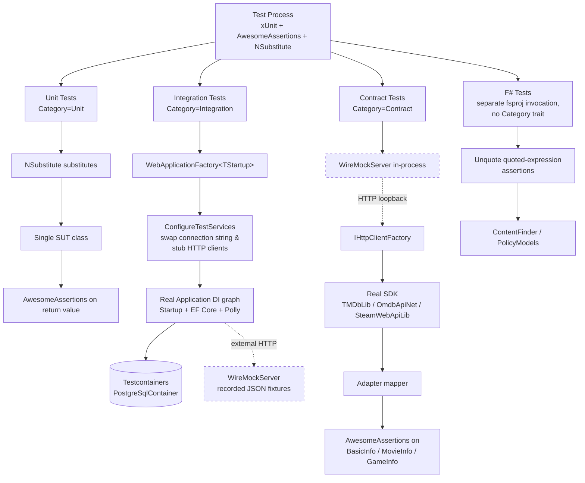

# ProjectV Scenario Tests — Overview

Companion to
[`Docs/Testing/Coverage/test-coverage.md`](../Coverage/test-coverage.md).
This document is the architecture-diagram baseline for the
`WebApplicationFactory`-based scenario suites covering JWT authentication,
Telegram webhook, and Telegram polling. Per-family scenario docs
(e.g. `projectv-jwt-scenarios.md`, `projectv-telegram-scenarios.md`,
`projectv-tmdb-pipeline-scenarios.md`, …) are added alongside their
respective scenario suites as they land.

## Purpose

Scenario tests in ProjectV are integration tests written one test file per
business scenario:

- One sealed test class per scenario; file name is `<ScenarioShortName>Tests.cs`.
- Class XML doc summarises the scenario in **business** terms (e.g.
  "Scenario JWT-1: Anonymous request to `/api/v1/Requests` returns 401"),
  not in test-framework terms.
- Class inherits from a per-family base class — e.g. `JwtAuthScenarioBaseTest`,
  `TelegramWebhookScenarioBaseTest`, `TmdbPipelineScenarioBaseTest` — which
  bundles the `WebApplicationFactory` wiring + scenario-family-wide config knobs.
- Test method bodies use **explicit `// Arrange.` / `// Act.` / `// Assert.`
  comment markers**. This convention was introduced during the test-coverage
  work tracked in PR #342; new scenario tests follow it without exception.
- Assertions cover production behavior AND stub-side call counts where
  relevant — for example, `wireMock.LogEntries.Should().HaveCount(1)` to
  verify that the SDK called the external API exactly once after a Polly
  retry policy completed.

The point is that the file name, class name, and XML doc together read like
a checklist of business behaviour, so a reviewer can scan the
`Scenarios/<ScenarioFamily>/` directory and see exactly what is being verified
without opening any test method.

## Audience

- **Scenario test authors** — engineers implementing `WebApplicationFactory`-based
  integration tests for the JWT authentication
  (`Sources/Tests/ProjectV.CommunicationWebService.Tests/Scenarios/Jwt/`),
  Telegram webhook
  (`Sources/Tests/ProjectV.TelegramBotWebService.Tests/Scenarios/Webhook/`),
  or Telegram polling
  (`Sources/Tests/ProjectV.TelegramBotWebService.Tests/Scenarios/Polling/`)
  suites. They use this overview
  to know which base class to inherit from, which Helpers wires up which
  external surface, and what shape an Arrange / Act / Assert block should
  take inside the scenario file.
- **Future contributors** adding new scenario families — they create a new
  per-family base class under
  `Sources/Tests/ProjectV.<WebService>.Tests/Scenarios/<ScenarioFamily>/`,
  add a per-family doc next to this overview, and follow the conventions
  named here.
- **Reviewers** of phase-end PRs — they use the diagram below to confirm
  that a new scenario test wires up the real production DI graph (no mocks
  on the request path) and that any external dependency lives behind a
  WireMock.Net stub.

Scenario tests live under
`Sources/Tests/ProjectV.<WebService>.Tests/Scenarios/<ScenarioFamily>/` —
one directory per scenario family, one file per scenario inside it.

## Architecture

The diagram below shows how a scenario test process drives the system under
test, including the `WebApplicationFactory` integration branch used by the
JWT and Telegram scenario suites.

Key invariants in the diagram:

- The **Real Application** node represents the production DI graph — the
  same `Startup` class production runs, the same `ICrawler` / `IAppraiser`
  / `IJobInfoService` registrations, the same EF Core `ProjectVDbContext`.
- The **only test doubles on the request path** are `WireMockServer`
  instances for external HTTP APIs (TMDb / OMDb / Steam) and a substituted
  `ITelegramBotClient` for the Telegram polling branch. There are no
  in-process mocks for the Application or Domain layers in scenario tests
  (that is the Unit-test layer's job).
- The **Testcontainers Postgres** node is the single per-test-run
  container started by `ICollectionFixture<DbCollectionFixture>`; the same
  container is reused across scenario test classes that share the
  `DbCollection` `CollectionDefinition`.

The dashed edges (`-.->`) and dashed-border nodes mark the only places where
a scenario test substitutes a real dependency: HTTP traffic to TMDb / OMDb /
Steam is routed through a local `WireMockServer` instance that serves recorded
JSON fixtures from `Sources/Tests/Fixtures/{Tmdb,Omdb,Steam}/`. Everything
else on the request path is production code running against a real
Testcontainers Postgres.

## Scenario Family Documents

Per-family docs are added by the plan that lands the family's scenario suite,
not up-front:

> Only scenario-family docs that correspond to scenario suites actually
> committed to the repository are created — the overview is mandatory,
> family docs are added as their scenario suites land.

Expected per-family doc filenames:

- `projectv-jwt-scenarios.md` — added alongside the JWT scenario suite
  (`Sources/Tests/ProjectV.CommunicationWebService.Tests/Scenarios/Jwt/`).
- `projectv-telegram-scenarios.md` — added alongside the Telegram webhook +
  polling scenario suites
  (`Sources/Tests/ProjectV.TelegramBotWebService.Tests/Scenarios/Webhook/` and `/Polling/`).
- `projectv-tmdb-pipeline-scenarios.md` — added if/when a TMDb-end-to-end
  scenario suite lands; current TMDb coverage is at the contract-test
  layer (`Sources/Tests/ProjectV.TmdbService.Tests/TmdbContractTests.cs`).

Family docs follow the same shape as this overview — Purpose, Audience,
Architecture (with a scenario-family-specific mermaid view), Conventions,
and a table that enumerates each scenario file with a one-line description.

## Conventions

- **Class XML doc** summarises the scenario in business terms. Bad:
  `"Tests that the controller returns 401 when no Authorization header is
  present."` Good: `"Scenario JWT-1: Anonymous request to /api/v1/Requests
  returns 401."`
- **Class shape** — `public sealed class <ScenarioShortName>Tests` with an
  explicit empty constructor (matches the rest of the ProjectV test stack).
- **Base class** — inherits from a per-family base class (e.g.
  `JwtAuthScenarioBaseTest`) that holds the `WebApplicationFactory`
  instance + scenario-family-wide config knobs. The base class is what
  swaps test-side HttpClients onto WireMock and tells the
  `ProjectVDbContext` to point at the Testcontainers Postgres.
- **AAA markers** — every test method body has explicit `// Arrange.`,
  `// Act.`, and `// Assert.` comment lines. No exceptions; even one-line
  acts include the marker.
- **Assertions** — assert on production behavior AND on stub-side call
  counts where the stub-side counts are part of the scenario semantics.
  Example: a "Polly retries transient 502 exactly once" scenario asserts
  on the final 200 response AND on `wireMockServer.LogEntries.Should()
  .HaveCount(2, "Polly should have retried once after the transient
  failure")`.
- **Category trait** — every scenario test class is
  `[Trait("Category","Integration")]`. Scenarios that hit Testcontainers
  Postgres also add `[Trait("RequiresDocker","true")]`. CI filters on these
  traits to separate Docker-dependent tests from non-Docker integration tests.
- **xUnit collection** — scenario tests that share the Testcontainers
  Postgres declare `[Collection(DbCollection.Name)]` so they run serially
  inside the single container session.

## Cross-references

- [`Docs/Testing/Coverage/test-coverage.md`](../Coverage/test-coverage.md) —
  critical-path coverage inventory; the scenarios documented here cover the
  `WebApplicationFactory` rows in the Infrastructure Layer table.
