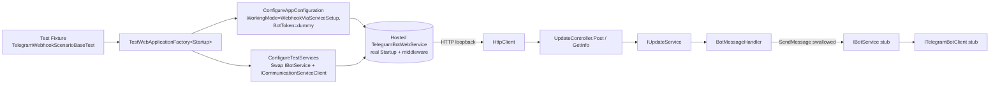

# ProjectV Telegram Scenario Tests

**Phase 2 deliverable** — companion to
[`projectv-scenario-tests-overview.md`](./projectv-scenario-tests-overview.md)
and [`../Coverage/test-coverage.md`](../Coverage/test-coverage.md).
This document is the per-family scenario doc for the Telegram-bot slice of
`ProjectV.TelegramBotWebService`. The Phase 2 plan suite delivers both halves:

- **Webhook scenarios** (Plan 02-11, this document) — synthetic Telegram
  `Update` JSON payloads POSTed at the production webhook endpoint via
  `WebApplicationFactory<Startup>`. Live in
  `Sources/Tests/ProjectV.TelegramBotWebService.Tests/Scenarios/Webhook/`.
- **Polling scenarios** (Plan 02-12, to land next) — the production
  `PoolingProcessor` hosted service exercised with a substituted
  `ITelegramBotClient` that yields a fixed sequence of `Update`s. Will live in
  `Sources/Tests/ProjectV.TelegramBotWebService.Tests/Scenarios/Polling/`.

Both halves share the conventions described in the overview doc (D-36).

## Purpose

Cover the full Telegram-bot path of `ProjectV.TelegramBotWebService`
end-to-end without contacting the live Telegram API. The scenarios exercise:

- The production webhook controller
  `Sources/WebServices/ProjectV.TelegramBotWebService/v1/Controllers/UpdateController.cs`
  (`POST /api/v1/Update`).
- The handler chain `IUpdateService` → `IBotHandler<Message>`
  (`BotMessageHandler`) → `IBotService.SendMessageAsync`.
- The full ASP.NET Core middleware stack including the custom
  `ExceptionMiddleware`, JWT bearer authentication (anonymous on this
  endpoint), and the API-versioning by-namespace convention that maps the
  controller to `/api/v1/Update`.
- For polling scenarios (02-12) the `PoolingProcessor` hosted service plus
  the `BotPolling` → `ITelegramBotClient.ReceiveAsync` → `BotPollingUpdateHandler`
  chain.

The Telegram bot path uses `IBotService` as the natural test seam: the
production `BotService` ctor instantiates a real `TelegramBotClient(BotToken,
HttpClient)` and throws on an empty `BotToken` — so every scenario test
replaces `IBotService` with an NSubstitute substitute whose `BotClient`
property returns a `TestTelegramBotClientBuilder`-produced
`ITelegramBotClient` stub. The webhook scenarios carry only
`[Trait("Category", "Integration")]` (no `[Trait("RequiresDocker", "true")]`)
because the webhook path does not touch the database; they run on both the
Linux Integration stage and the Windows Non-Docker stage of CI (decisions
D-21 / D-22).

## Audience

- **Test authors** adding new Telegram-bot scenarios — for example expired-
  authentication, command-with-bad-arguments, or specific `Update` types
  beyond `Message` (callback queries, edited messages, etc.). They inherit
  from `TelegramWebhookScenarioBaseTest` (or `TelegramPollingScenarioBaseTest`
  once 02-12 lands) and follow the conventions below.
- **Reviewers** scanning the family folder — the class XML doc on each test
  file reads like a business-language sentence so a reviewer can scan the
  directory and immediately see what behaviour is covered.

## Architecture

Each webhook test class inherits the family base
[`TelegramWebhookScenarioBaseTest`](../../../Sources/Tests/ProjectV.TelegramBotWebService.Tests/Scenarios/Webhook/TelegramWebhookScenarioBaseTest.cs),
which extends `ProjectV.Tests.Shared.ForTests.WebApiBaseTest<Startup>`. The
base wires up an in-process
`TestWebApplicationFactory<ProjectV.TelegramBotWebService.Startup>` with:

- **In-memory configuration overrides** — sets
  `TelegramBotWebServiceOptions:WorkingMode` to `WebhookViaServiceSetup` so
  the production polling / webhook hosted services are NOT registered (their
  ctors would resolve `IBotService` before the test-side swap), and supplies
  a dummy non-empty `Bot:Token` so `BotOptions.Validate()` does not throw.
- **`IBotService` swap** — removes the production singleton and re-registers
  an NSubstitute substitute whose `BotClient` property returns the supplied
  `ITelegramBotClient` stub from
  [`TestTelegramBotClientBuilder`](../../../Sources/Tests/ProjectV.Tests.Shared/Helpers/Mocks/Telegram/TestTelegramBotClientBuilder.cs).
- **`ICommunicationServiceClient` swap** — removes the production transient
  and re-registers a no-setup
  [`TestCommunicationServiceClientBuilder.CreateWithoutSetup()`](../../../Sources/Tests/ProjectV.Tests.Shared/Helpers/Mocks/Core/TestCommunicationServiceClientBuilder.cs)
  stub so handler resolution does not try to construct the production
  `CommunicationServiceClient` (which has a strict options-validation
  chain that fails in tests).

## Scenario Catalog

| Scenario | Test File | Endpoint | Expected Outcome |
|----------|-----------|----------|------------------|
| **TG-WEB-1** — Valid text-message Update | `TelegramWebhookTextMessageTests.cs` | `POST /api/v1/Update` with a `Telegram.Bot.Types.Update` containing a `/start` `Message` | `200 OK` (handler chain runs end-to-end) |
| **TG-WEB-2** — Malformed JSON rejected | `TelegramWebhookInvalidPayloadTests.cs` | `POST /api/v1/Update` with `{ not valid json` body | `4xx` client error from the `AddNewtonsoftJson` model binder |

### Scenario TG-WEB-1: Valid text-message Update

A synthetic `Update` with a `Message` carrying the `/start` text reaches the
webhook controller, deserialises through `AddNewtonsoftJson`, flows into
`IUpdateService.HandleUpdateAsync`, dispatches to `BotMessageHandler`, and
the bot handler's `SendMessageAsync` call hits the substituted `IBotService`
(no-op). The scenario asserts the controller returns `200 OK` — that single
status proves the entire model-binding + auth + middleware + handler chain
is healthy on the webhook path. The scenario does NOT assert on outgoing
bot calls; that level of verification belongs to the bot-message-handler
unit-test layer that 02-04 / 02-05 cover.

### Scenario TG-WEB-2: Malformed JSON rejected

A request body that is not valid JSON is rejected by the production
model-binder pipeline before the action runs. With `[ApiController]` on the
controller, ASP.NET Core auto-rejects an unbound model state with HTTP 400.
The scenario asserts the status code is in the 4xx range — the exact value
comes from the production
`AddNewtonsoftJson` configuration, not from any code in this plan, so the
test asserts the production behavior as-is rather than dictating a specific
400 versus 415 outcome (Phase 2 tests around existing semantics, does not
change them).

## Conventions

Telegram webhook scenario tests follow the conventions described in
[`projectv-scenario-tests-overview.md`](./projectv-scenario-tests-overview.md#conventions)
without exception. Two family-specific points:

- **No `[Trait("RequiresDocker", "true")]`** — webhook scenarios run
  entirely in-process; no Testcontainers Postgres is started. They run on
  the Windows Non-Docker stage of CI in addition to the Linux Integration
  stage (D-22). The polling scenarios delivered by 02-12 will share this
  trait — polling does not need the DB either.
- **`IBotService` is the natural seam** — not `ITelegramBotClient`. The
  production `BotService.BotClient` getter returns the live bot client;
  substituting `IBotService` directly (with `BotClient` returning the
  `ITelegramBotClient` stub) keeps the production ctor's bot-token check
  out of the test path. `TestTelegramBotClientBuilder` builds the
  `ITelegramBotClient` substitute; the per-family base class composes it
  inside the `IBotService` substitute via NSubstitute's `Returns(...)`.

## Cross-references

- [`Docs/Testing/Coverage/test-coverage.md`](../Coverage/test-coverage.md) —
  Infrastructure-Layer row for the TelegramBotWebService webhook scenario.
- [`Docs/Testing/Scenarios/projectv-scenario-tests-overview.md`](./projectv-scenario-tests-overview.md) —
  cross-family conventions, architecture diagram, scenario-test pattern.
- [`Sources/Tests/ProjectV.Tests.Shared/Helpers/Mocks/Telegram/TestTelegramBotClientBuilder.cs`](../../../Sources/Tests/ProjectV.Tests.Shared/Helpers/Mocks/Telegram/TestTelegramBotClientBuilder.cs) —
  `ITelegramBotClient` substitute builder with optional update-sequence
  configuration for polling.
- [`Sources/Tests/ProjectV.Tests.Shared/Helpers/WebApi/TestWebApplicationFactory.cs`](../../../Sources/Tests/ProjectV.Tests.Shared/Helpers/WebApi/TestWebApplicationFactory.cs) —
  generic test host wrapper with optional `TelegramBotClientStub` /
  `CommunicationServiceClientStub` init properties.
- `.planning/phases/02-test-coverage/02-11-telegram-webhook-tests-PLAN.md` —
  decisions D-15 / D-36 / D-37 with their full rationale.
- `.planning/phases/02-test-coverage/02-12-telegram-polling-tests-PLAN.md`
  (forward reference) — will deliver the polling scenarios `TG-POLL-*`.
