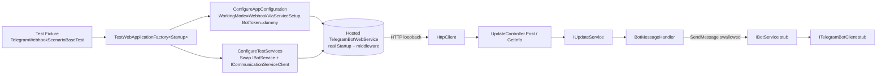

# ProjectV Telegram Scenario Tests

Companion to
[`projectv-scenario-tests-overview.md`](./projectv-scenario-tests-overview.md)
and [`../Coverage/test-coverage.md`](../Coverage/test-coverage.md).
This document is the per-family scenario doc for the Telegram-bot slice of
`ProjectV.TelegramBotWebService`. It covers both halves of the scenario suite:

- **Webhook scenarios** (Telegram webhook scenarios — `Sources/Tests/ProjectV.TelegramBotWebService.Tests/Scenarios/Webhook/`) — synthetic Telegram
  `Update` JSON payloads POSTed at the production webhook endpoint via
  `WebApplicationFactory<Startup>`. Live in
  `Sources/Tests/ProjectV.TelegramBotWebService.Tests/Scenarios/Webhook/`.
- **Polling scenarios** (Telegram polling scenarios — `Sources/Tests/ProjectV.TelegramBotWebService.Tests/Scenarios/Polling/`) — the production
  `PoolingProcessor` hosted service exercised end-to-end with a substituted
  `ITelegramBotClient` that yields a fixed sequence of `Update`s. Live in
  `Sources/Tests/ProjectV.TelegramBotWebService.Tests/Scenarios/Polling/`.

Both halves share the conventions described in the overview doc.

## Purpose

Cover the full Telegram-bot path of `ProjectV.TelegramBotWebService`
end-to-end without contacting the live Telegram API. The scenarios exercise:

- The production webhook controller
  `Sources/WebServices/ProjectV.TelegramBotWebService/v1/Controllers/UpdateController.cs`
  (`POST /api/v1/Update`).
- The handler chain `IUpdateService` → `IBotHandler<Message>`
  (`BotMessageHandler`) → `IBotService.SendMessageAsync`.
- The full ASP.NET Core middleware stack including the custom
  `ExceptionMiddleware`, JWT bearer authentication (anonymous on this
  endpoint), and the API-versioning by-namespace convention that maps the
  controller to `/api/v1/Update`.
- For polling scenarios the `PoolingProcessor` hosted service plus the
  `BotPolling` → `ITelegramBotClient.ReceiveAsync` → `BotPollingUpdateHandler`
  → `UpdateService` → `BotMessageHandler` chain, exercised with a scripted
  update sequence supplied through
  `TestTelegramBotClientBuilder.WithUpdateSequence(...)`.

The Telegram bot path uses `IBotService` as the natural test seam: the
production `BotService` ctor instantiates a real `TelegramBotClient(BotToken,
HttpClient)` and throws on an empty `BotToken` — so every scenario test
replaces `IBotService` with an NSubstitute substitute whose `BotClient`
property returns a `TestTelegramBotClientBuilder`-produced
`ITelegramBotClient` stub. The webhook scenarios carry only
`[Trait("Category", "Integration")]` (no `[Trait("RequiresDocker", "true")]`)
because the webhook path does not touch the database; they run on both the
Linux Integration stage and the Windows Non-Docker stage of CI.

## Audience

- **Test authors** adding new Telegram-bot scenarios — for example expired-
  authentication, command-with-bad-arguments, or specific `Update` types
  beyond `Message` (callback queries, edited messages, etc.). They inherit
  from `TelegramWebhookScenarioBaseTest` (for webhook scenarios) or
  `TelegramPollingScenarioBaseTest` (for polling scenarios) and follow the
  conventions below.
- **Reviewers** scanning the family folder — the class XML doc on each test
  file reads like a business-language sentence so a reviewer can scan the
  directory and immediately see what behaviour is covered.

## Architecture

Each webhook test class inherits the family base
[`TelegramWebhookScenarioBaseTest`](../../../Sources/Tests/ProjectV.TelegramBotWebService.Tests/Scenarios/Webhook/TelegramWebhookScenarioBaseTest.cs),
which extends `ProjectV.Tests.Shared.ForTests.WebApiBaseTest<Startup>`. The
base wires up an in-process
`TestWebApplicationFactory<ProjectV.TelegramBotWebService.Startup>` with:

- **In-memory configuration overrides** — sets
  `TelegramBotWebServiceOptions:WorkingMode` to `WebhookViaServiceSetup` so
  the production polling / webhook hosted services are NOT registered (their
  ctors would resolve `IBotService` before the test-side swap), and supplies
  a dummy non-empty `Bot:Token` so `BotOptions.Validate()` does not throw.
- **`IBotService` swap** — removes the production singleton and re-registers
  an NSubstitute substitute whose `BotClient` property returns the supplied
  `ITelegramBotClient` stub from
  [`TestTelegramBotClientBuilder`](../../../Sources/Tests/ProjectV.Tests.Shared/Helpers/Mocks/Telegram/TestTelegramBotClientBuilder.cs).
- **`ICommunicationServiceClient` swap** — removes the production transient
  and re-registers a no-setup
  [`TestCommunicationServiceClientBuilder.CreateWithoutSetup()`](../../../Sources/Tests/ProjectV.Tests.Shared/Helpers/Mocks/Core/TestCommunicationServiceClientBuilder.cs)
  stub so handler resolution does not try to construct the production
  `CommunicationServiceClient` (which has a strict options-validation
  chain that fails in tests).



## Scenario Catalog

| Scenario | Test File | Driver | Expected Outcome |
|----------|-----------|--------|------------------|
| **TG-WEB-1** — Valid text-message Update | `TelegramWebhookTextMessageTests.cs` | `POST /api/v1/Update` with a `Telegram.Bot.Types.Update` containing a `/start` `Message` | `200 OK` (handler chain runs end-to-end) |
| **TG-WEB-2** — Malformed JSON rejected | `TelegramWebhookInvalidPayloadTests.cs` | `POST /api/v1/Update` with `{ not valid json` body | `4xx` client error from the `AddNewtonsoftJson` model binder |
| **TG-POLL-1** — Polling drains a scripted Update sequence | `TelegramPollingProcessesUpdateSequenceTests.cs` | `PoolingProcessor` `BackgroundService` started by the host with `WorkingMode=PollingViaHostedService`; substitute `ITelegramBotClient` pre-loaded via `TestTelegramBotClientBuilder.WithUpdateSequence` yields three text-message updates on the first poll | `IBotService.SendMessageAsync` is called at least once per update (handler chain runs end-to-end through the polling path) |

### Scenario TG-WEB-1: Valid text-message Update

A synthetic `Update` with a `Message` carrying the `/start` text reaches the
webhook controller, deserialises through `AddNewtonsoftJson`, flows into
`IUpdateService.HandleUpdateAsync`, dispatches to `BotMessageHandler`, and
the bot handler's `SendMessageAsync` call hits the substituted `IBotService`
(no-op). The scenario asserts the controller returns `200 OK` — that single
status proves the entire model-binding + auth + middleware + handler chain
is healthy on the webhook path. The scenario does NOT assert on outgoing
bot calls; that level of verification belongs to the bot-message-handler
unit-test layer covering `BotMessageHandler` and its collaborators.

### Scenario TG-WEB-2: Malformed JSON rejected

A request body that is not valid JSON is rejected by the production
model-binder pipeline before the action runs. With `[ApiController]` on the
controller, ASP.NET Core auto-rejects an unbound model state with HTTP 400.
The scenario asserts the status code is in the 4xx range — the exact value
comes from the production
`AddNewtonsoftJson` configuration, not from any code in this plan, so the
test asserts the production behavior as-is rather than dictating a specific
400 versus 415 outcome (the scenario tests existing semantics, does not
change them).

## Polling Scenarios

Polling tests inherit the family base
[`TelegramPollingScenarioBaseTest`](../../../Sources/Tests/ProjectV.TelegramBotWebService.Tests/Scenarios/Polling/TelegramPollingScenarioBaseTest.cs),
which (like the webhook base) extends
`ProjectV.Tests.Shared.ForTests.WebApiBaseTest<Startup>`. Two things differ
from the webhook base:

- **`WorkingMode=PollingViaHostedService`** — the production `Startup`
  registers `PoolingProcessor` as a `BackgroundService` only under this
  working mode. The host starts the background polling loop when
  `TestWebApplicationFactory.CreateClient()` triggers `IHost.StartAsync()`,
  AFTER `ConfigureTestServices` has swapped `IBotService`. The polling
  processor resolves `IBotPolling` → which depends on `IBotService` → which
  is the test-side substitute by the time the resolution happens.
- **`IBotService.DeleteWebhookAsync` + `IBotService.SendMessageAsync`
  stubbed explicitly** — `BotPolling.StartReceivingUpdatesAsync` calls
  `DeleteWebhookAsync` before entering the receive loop, and the
  `BotMessageHandler` chain calls `SendMessageAsync` for every update it
  drains. Stubbing both deterministically lets the polling loop run
  uninterrupted and lets the test assert on the substituted
  `SendMessageAsync` call-count to verify the handler chain ran end-to-end.

```mermaid
flowchart LR
    TF[Test Fixture<br/>TelegramPollingScenarioBaseTest]
    TF --> WAF[TestWebApplicationFactory&lt;Startup&gt;]
    WAF --> CFG[ConfigureAppConfiguration<br/>WorkingMode=PollingViaHostedService,<br/>BotToken=dummy]
    WAF --> CTS[ConfigureTestServices<br/>Swap IBotService + ICommunicationServiceClient]
    CFG --> HOST[(Hosted TelegramBotWebService<br/>IHost.StartAsync runs PoolingProcessor)]
    CTS --> HOST
    HOST --> PP[PoolingProcessor.ExecuteAsync]
    PP --> BP[BotPolling.StartReceivingUpdatesAsync]
    BP --> BS[IBotService stub<br/>DeleteWebhookAsync stubbed]
    BP --> RA[BotClient.ReceiveAsync extension]
    RA --> SR[ITelegramBotClient.SendRequest&lt;Update[]&gt;<br/>yields scripted batch then empty]
    SR --> UH[BotPollingUpdateHandler.HandleUpdateAsync]
    UH --> US[UpdateService.HandleUpdateAsync]
    US --> BMH[BotMessageHandler.ProcessAsync]
    BMH --> SM[IBotService.SendMessageAsync<br/>Received&#40;N&#41; → assertion]
```

### Scenario TG-POLL-1: Polling drains a scripted Update sequence

A `TestTelegramBotClientBuilder.WithUpdateSequence(...)` substitute is built
with three text-message updates (`/start`, `/help`, and a freeform "Hello
there"). The substitute primes the bot client's `SendRequest<Update[]>` so
the first poll yields the scripted batch and every subsequent poll yields
an empty array. The host's `PoolingProcessor` starts the receive loop on
`IHost.StartAsync()`; the loop forwards each update through
`BotPollingUpdateHandler` → `UpdateService.HandleUpdateAsync` →
`BotMessageHandler.ProcessAsync` → `IBotService.SendMessageAsync`. The
scenario waits on the substituted `IBotService` with a bounded 15-second
timeout (a polling loop must never hang the suite) and asserts the `SendMessageAsync` call-count is at
least 3. The single-method assertion proves the entire polling chain is
healthy end-to-end without relying on internal details of the Telegram
receiver implementation.

## Conventions

Telegram scenario tests — both webhook and polling — follow the conventions
described in
[`projectv-scenario-tests-overview.md`](./projectv-scenario-tests-overview.md#conventions)
without exception. Three family-specific points:

- **No `[Trait("RequiresDocker", "true")]`** — webhook AND polling
  scenarios run entirely in-process; no Testcontainers Postgres is
  started. They run on the Windows Non-Docker stage of CI in addition to
  the Linux Integration stage. Polling does not need the DB any
  more than webhook does — the production polling loop runs against the
  substituted bot client, which never reaches the real
  `CommunicationServiceClient`'s downstream-job persistence path on
  the commands these scenarios exercise.
- **`IBotService` is the natural seam** — not `ITelegramBotClient`. The
  production `BotService.BotClient` getter returns the live bot client;
  substituting `IBotService` directly (with `BotClient` returning the
  `ITelegramBotClient` stub) keeps the production ctor's bot-token check
  out of the test path. `TestTelegramBotClientBuilder` builds the
  `ITelegramBotClient` substitute; the per-family base class composes it
  inside the `IBotService` substitute via NSubstitute's `Returns(...)`.
  For polling, the same base also stubs
  `IBotService.DeleteWebhookAsync` and `IBotService.SendMessageAsync` so
  the receive loop runs uninterrupted and the test can read the
  `SendMessageAsync` call-count back deterministically.
- **Bounded polling loop** — every polling scenario uses a
  `CancellationTokenSource(TimeSpan.FromSeconds(15))` (or shorter) when
  waiting on the substituted bot client. A hosted polling service must
  never hang the suite, even when the substitute is misconfigured.
  Disposing the
  `TestWebApplicationFactory` (handled by `WebApiBaseTest.DisposeAsync`)
  signals the host's stopping token and tears the loop down cleanly.

## Cross-references

- [`Docs/Testing/Coverage/test-coverage.md`](../Coverage/test-coverage.md) —
  Infrastructure-Layer rows for the TelegramBotWebService webhook and
  polling scenarios.
- [`Docs/Testing/Scenarios/projectv-scenario-tests-overview.md`](./projectv-scenario-tests-overview.md) —
  cross-family conventions, architecture diagram, scenario-test pattern.
- [`Sources/Tests/ProjectV.Tests.Shared/Helpers/Mocks/Telegram/TestTelegramBotClientBuilder.cs`](../../../Sources/Tests/ProjectV.Tests.Shared/Helpers/Mocks/Telegram/TestTelegramBotClientBuilder.cs) —
  `ITelegramBotClient` substitute builder with optional update-sequence
  configuration for polling.
- [`Sources/Tests/ProjectV.Tests.Shared/Helpers/WebApi/TestWebApplicationFactory.cs`](../../../Sources/Tests/ProjectV.Tests.Shared/Helpers/WebApi/TestWebApplicationFactory.cs) —
  generic test host wrapper with optional `TelegramBotClientStub` /
  `CommunicationServiceClientStub` init properties.
