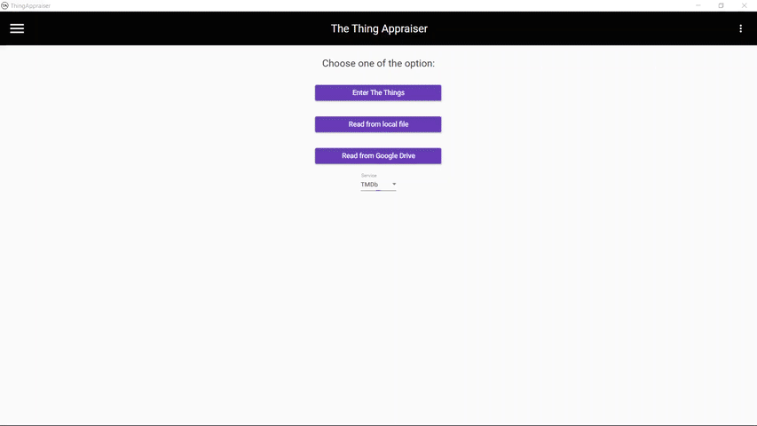
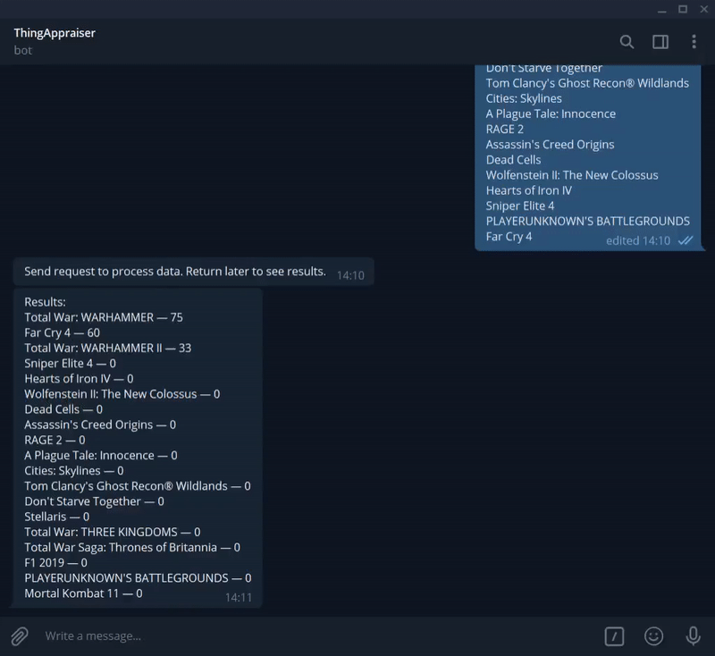
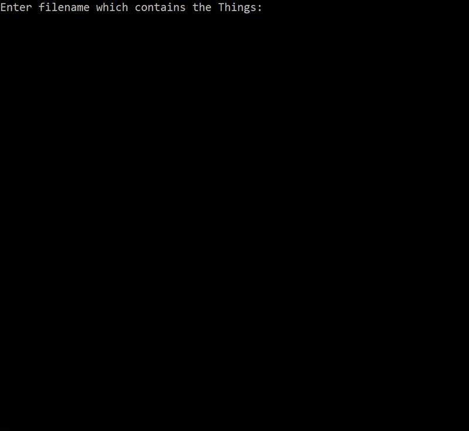

# ThingAppraiser

Evaluate your things (movies, games, books e.t.c.) automatically based on popular databases with ratings.

## Usage examples

| Desktop app                                                                                      |
|--------------------------------------------------------------------------------------------------|
|                    |

| Telegram bot service                                                                             |
|--------------------------------------------------------------------------------------------------|
| |

| Console app                                                                                      |
|--------------------------------------------------------------------------------------------------|
|                    |

## Dependencies

Target .NET Standard is 2.1 for libraries, .NET Core is 3.0 for web services and for desktop app. Version of C# is 8.0, version of F# is 4.7.

You can install all dependencies using NuGet package manager.

## Set up project guide

You can read full instruction in project [Wiki](https://github.com/Vasar007/ThingAppraiser/wiki/Set-up-project).

## License information

This project is licensed under the terms of the [Apache License 2.0](LICENSE).

### Third party software and libraries used

#### [Newtonsoft.Json](https://github.com/JamesNK/Newtonsoft.Json)

Copyright © 2007 James Newton-King

License: [MIT](https://github.com/JamesNK/Newtonsoft.Json/blob/master/LICENSE.md)

#### [Acolyte.NET](https://github.com/Vasar007/Acolyte.NET)

Copyright © 2020 Vasily Vasilyev (vasar007@yandex.ru)

License: [Apache License 2.0](https://github.com/Vasar007/Acolyte.NET/blob/master/LICENSE)