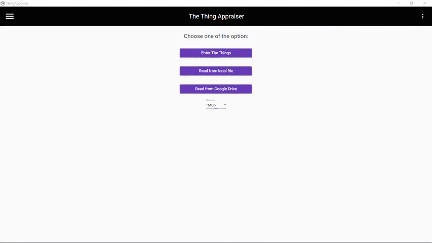
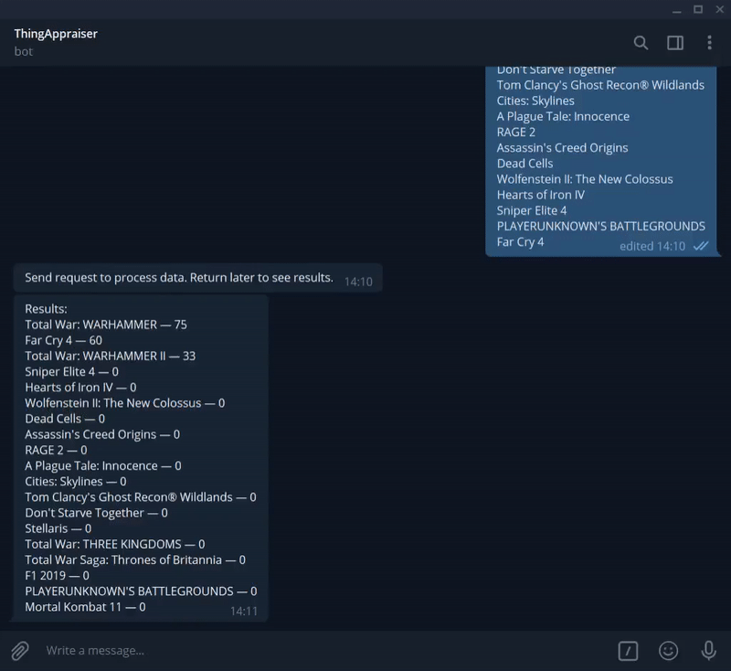
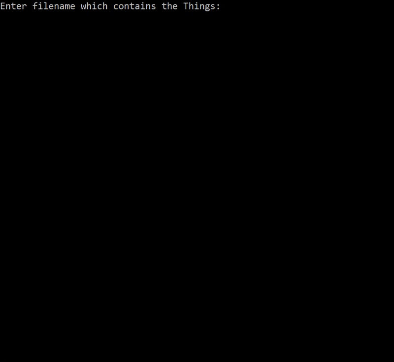

# ProjectV

[](https://github.com/Vasar007/ProjectV/blob/master/LICENSE)
[](https://github.com/Vasar007/ProjectV/actions/workflows/build.yml)
[](https://app.fossa.io/projects/git%2Bgithub.com%2FVasar007%2FProjectV?ref=badge_shield)

[](https://github.com/Vasar007/ProjectV/wiki)

Evaluate your things (movies, games, books e.t.c.) automatically based on popular databases with ratings.

## Usage examples

| Desktop app                                                                                      |
|--------------------------------------------------------------------------------------------------|
|                    |

| Telegram bot service                                                                             |
|--------------------------------------------------------------------------------------------------|
| |

| Console app                                                                                      |
|--------------------------------------------------------------------------------------------------|
|                    |

## Dependencies

Target .NET is 10.0 for all projects. Version of C# is 12.0, version of F# is 8.0.

You can install all dependencies using NuGet package manager.

## Set up project guide

You can read full instruction in project [Wiki](https://github.com/Vasar007/ProjectV/wiki/Set-up-project).

### EF Core migrations (development)

Before running `dotnet ef migrations add` (or any other EF Core CLI command), set the
`DatabaseOptions__ConnectionString` environment variable to a valid Npgsql connection string:

```bash
export DatabaseOptions__ConnectionString="Host=localhost;Port=5432;Database=ProjectV;Username=postgres;Password=postgres"
```

The design-time factory (`ProjectVDbContextDesignTimeFactory`) throws `InvalidOperationException`
when this variable is unset — there is no hardcoded fallback.

## License information

This project is licensed under the terms of the [Apache License 2.0](LICENSE).

[](https://app.fossa.io/projects/git%2Bgithub.com%2FVasar007%2FProjectV?ref=badge_large)
